<!-- Heading start-->
<h3 align="center">feature/dashboard</h3>

Angular landing page and dashboard

<ul>
	<li>Client uses Angular</li>
	<li>Server uses Spring Boot</li>

</ul>

    <picture>
        
    </picture>

## Contents
- [Backlog](#backlog)
- [Languages](#languages)
- [Testing](#testing)
- [Screenshots](#screenshots)
- [Demo](#demo)

### Backlog
- [x] Scaffold new app
- [x] TDD with unit testing
- [x] Register page
  - Toggle password 👁️ and 🔒
  - Custom validation:
    - username/email taken
    - password strength
- [x] Login page
  - Forgot Password:
    - user submits their email
    - create a new password
- [x] Asynchronous form validation feedback
- [ ] Deploy
- [ ] Add autocomplete to forms

### Languages

 

### Testing

## Demo
#### Development user testing on localhost

<ul>
    <li>server port 8080</li>
    <li>Postgres port 5432</li>
    <li>client port 80</li>
</ul>

## `Landing page`
[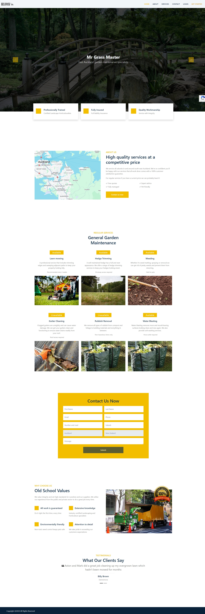](.github/readme/demo/landing.jpeg)
 

#### `Contact form validation`

#### `Error submitting contact form`
[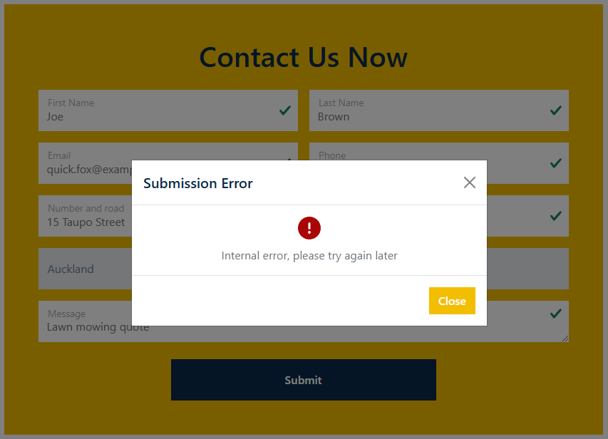](.github/readme/demo/contact-error.png)

#### `Successfully submission`

#### `Server writes record to database`
[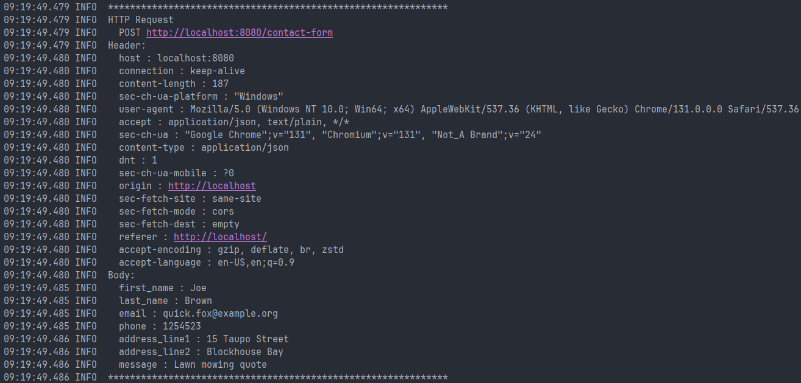](.github/readme/demo/http-contact.png)
[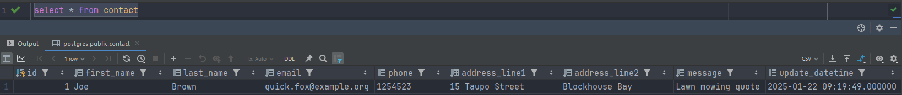](.github/readme/demo/database-contact.png)

## `Signup form`
#### `Form validation`
[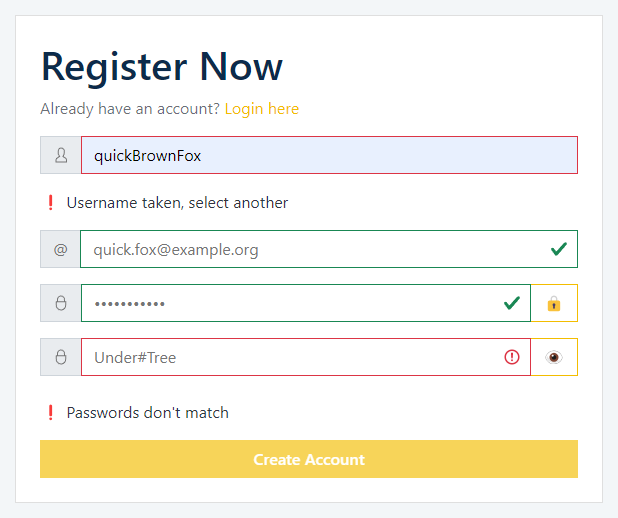](.github/readme/demo/register-validation.png)

#### `Request to check if username is taken`
[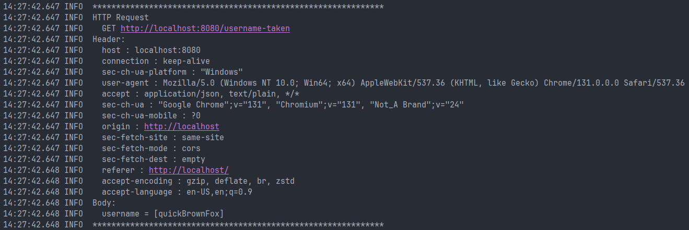](.github/readme/demo/http-username.png)

#### `Unsuccessful submission`
[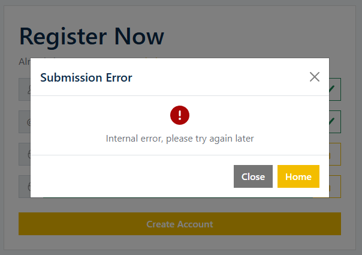](.github/readme/demo/register-error.png)

#### `Successful submission`

#### `Record written to database`
[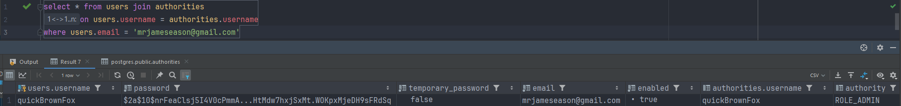](.github/readme/demo/database-register.png)

## `Forgot Password`
#### `Enter email to receive one-time password`
[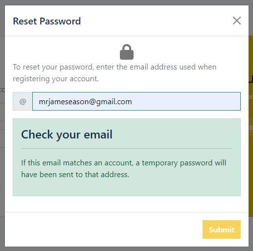](.github/readme/demo/forgot-password-email.png)

#### `Password received`
[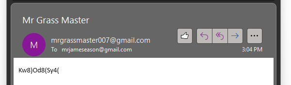](.github/readme/demo/temporary-password.png)

#### `Sets accounts temporary attribute true (indicates password is temporary)`
[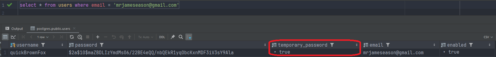](.github/readme/demo/database-temporary-true.png)

#### `Attempting to login with one-time password prompts user to change it`
[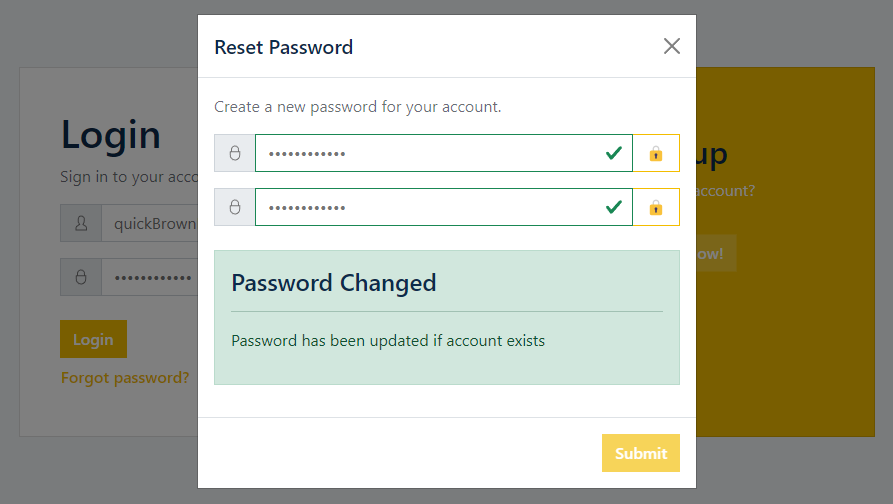](.github/readme/demo/new-password.png)

#### `Resetting password sets temporary false (indicates password is not temporary)`
[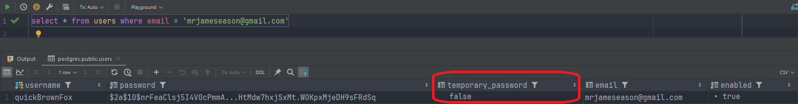](.github/readme/demo/database-temporary-false.png)

#### `Successfully logged into a dashboard`
[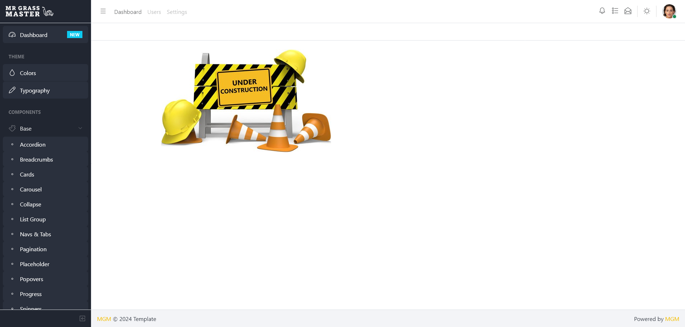](.github/readme/demo/dashboard.png)

