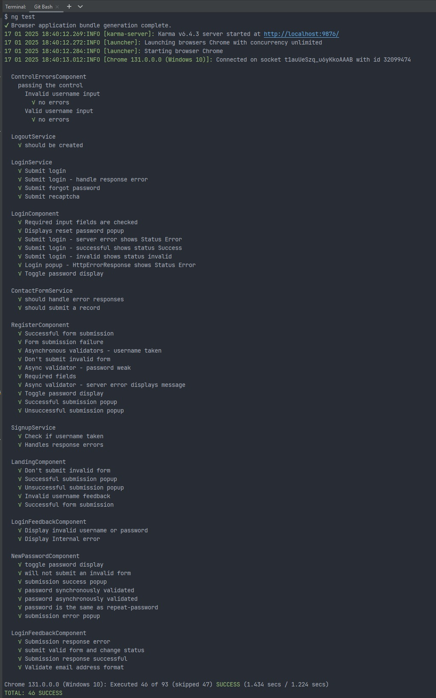
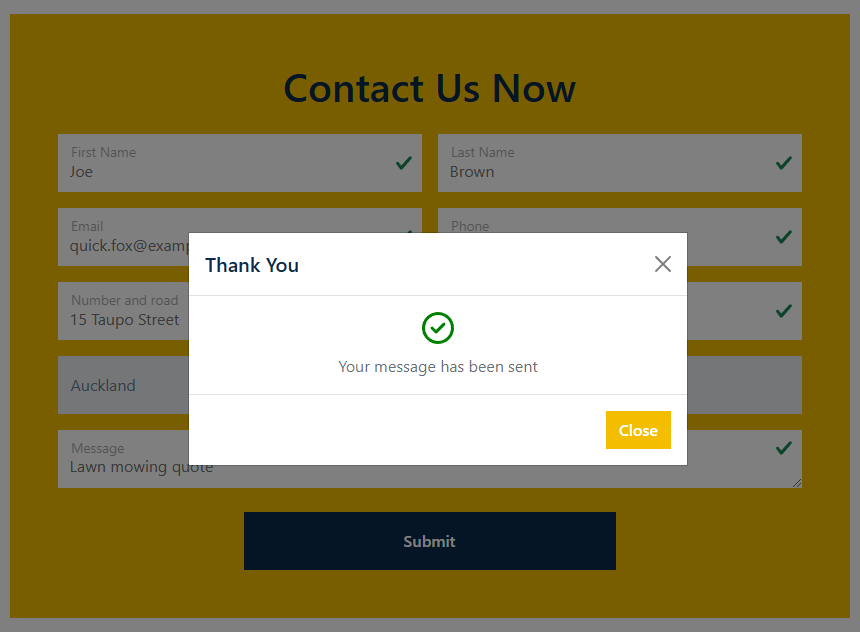
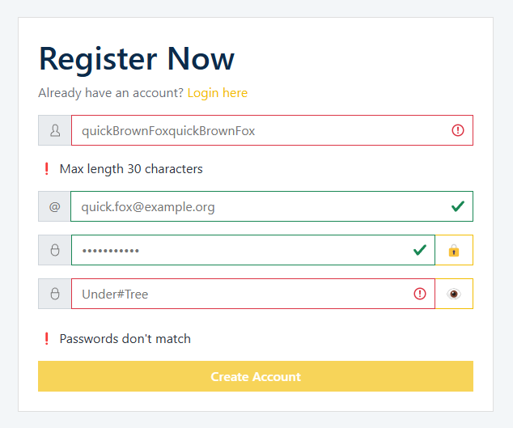
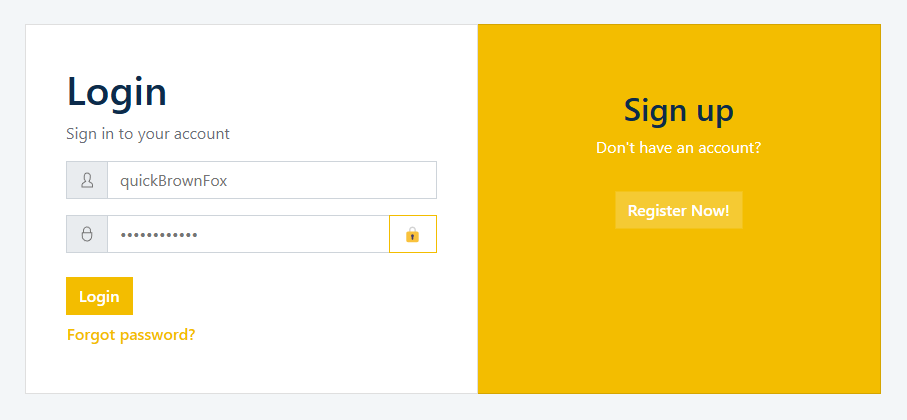
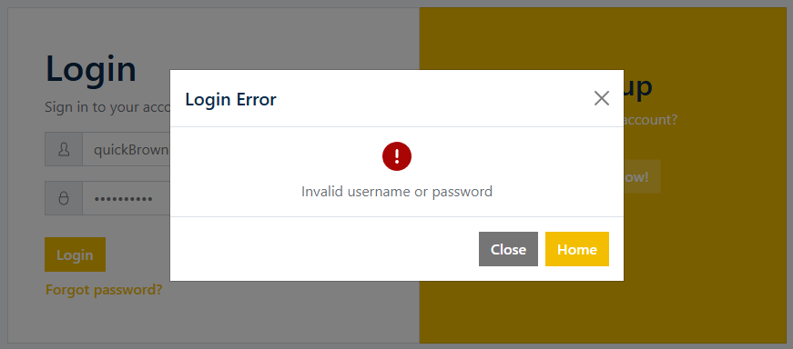
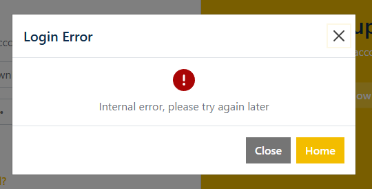
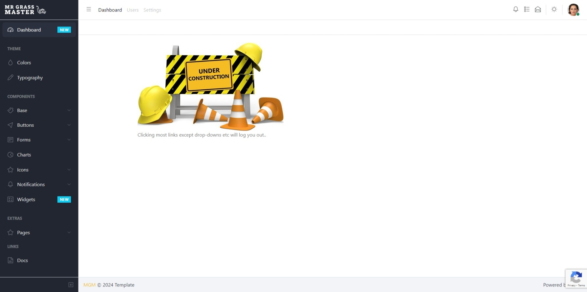
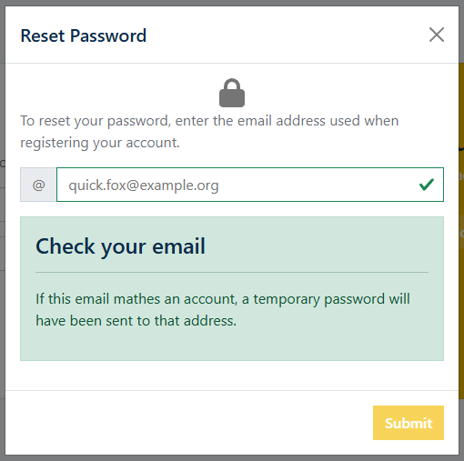
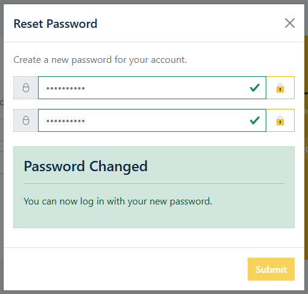

<!-- Heading start-->
<h3 align="center">feature/dashboard</h3>

Angular landing page and dashboard

<ul>
	<li>Client uses Angular</li>
	<li>Server uses Spring Boot</li>

</ul>

    <picture>
        
    </picture>

## Contents
- [Backlog](#backlog)
- [Languages](#languages)
- [Testing](#testing)
- [Screenshots](#screenshots)
- [Demo](#demo)

### Backlog
- [x] Scaffold new app
- [x] TDD with unit testing
- [x] Register page
  - Toggle password 👁️ and 🔒
  - Custom validation:
    - username/email taken
    - password strength
- [x] Login page
  - Forgot Password:
    - user submits their email
    - create a new password
- [x] Asynchronous form validation feedback
- [ ] Deploy
- [ ] Add autocomplete to forms

### Languages

 

### Testing

### Screenshots
### `Landing`

 
 

 
 

 
 

### `Register`

 
 

 
 

 

### `Login`

 
 

 
 

 
#### `Successful login redirects to dashboard (under construction)`

#### `Login - Reset password`

 

#### `Login - Set new password`

 

### Demo
