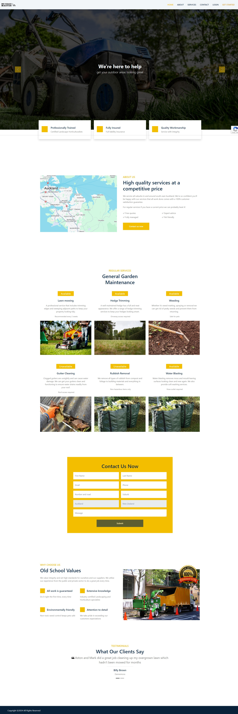
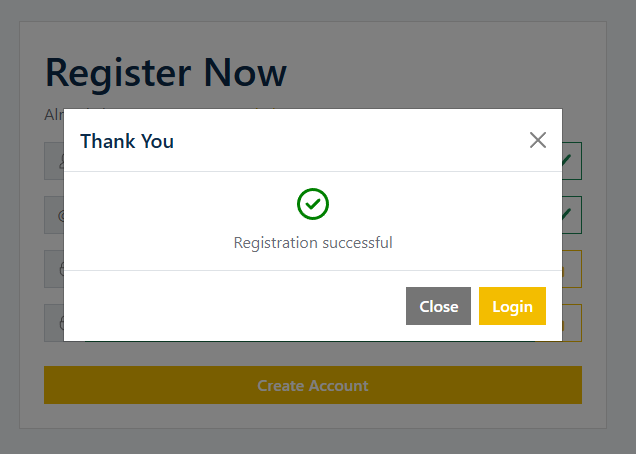
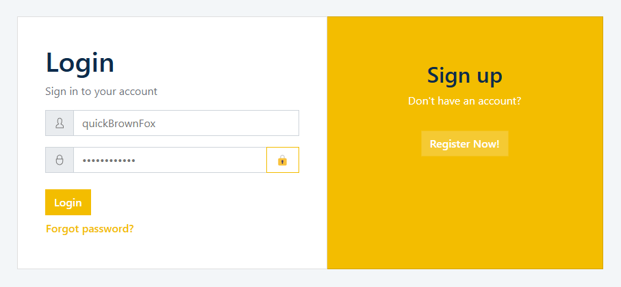
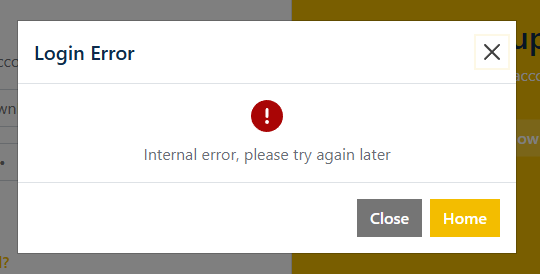
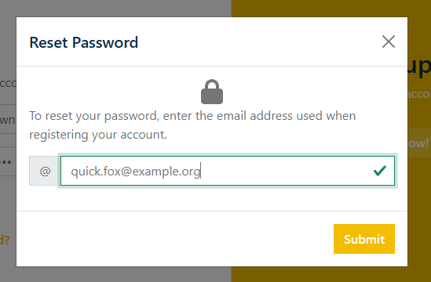
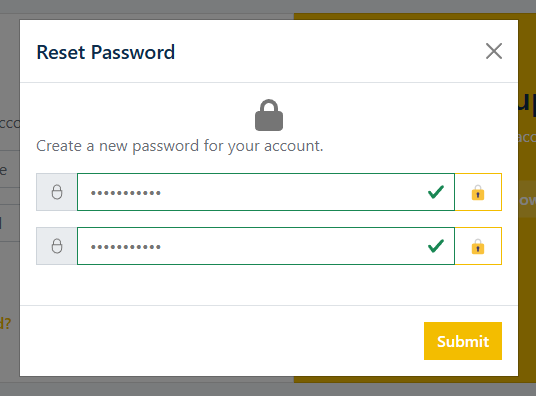

<!-- Heading start-->
<h3 align="center">feature/dashboard</h3>

Angular landing page and dashboard

    <picture>
        
    </picture>

### Backlog
- [x] Scaffold new app
- [x] TDD with unit testing
- [x] Register page
  - Toggle password 👁️ and 🔒
  - Custom validation:
    - username/email taken
    - password strength
- [x] Login page
  - Forgot Password:
    - user submits their email
    - create a new password
- [x] Asynchronous form validation feedback
- [ ] Docker image
- [ ] Deploy on AWS
- [ ] Encrypt request body e.g. passwords

 

 

### Screenshots
### `Landing`

 

### `Register`

 

 

### `Login`

 

### `Login Error`

 

### `Reset Password`

 

### `New Password`

 
