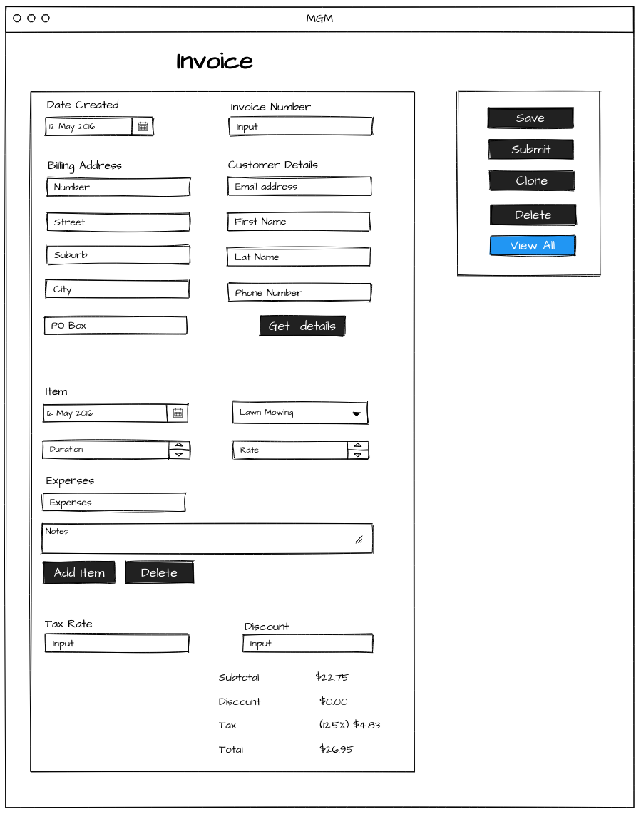
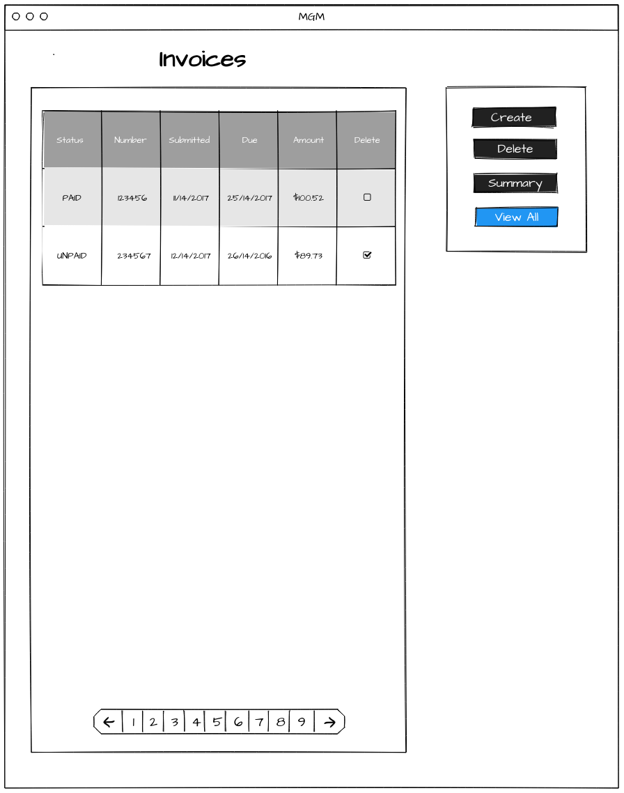
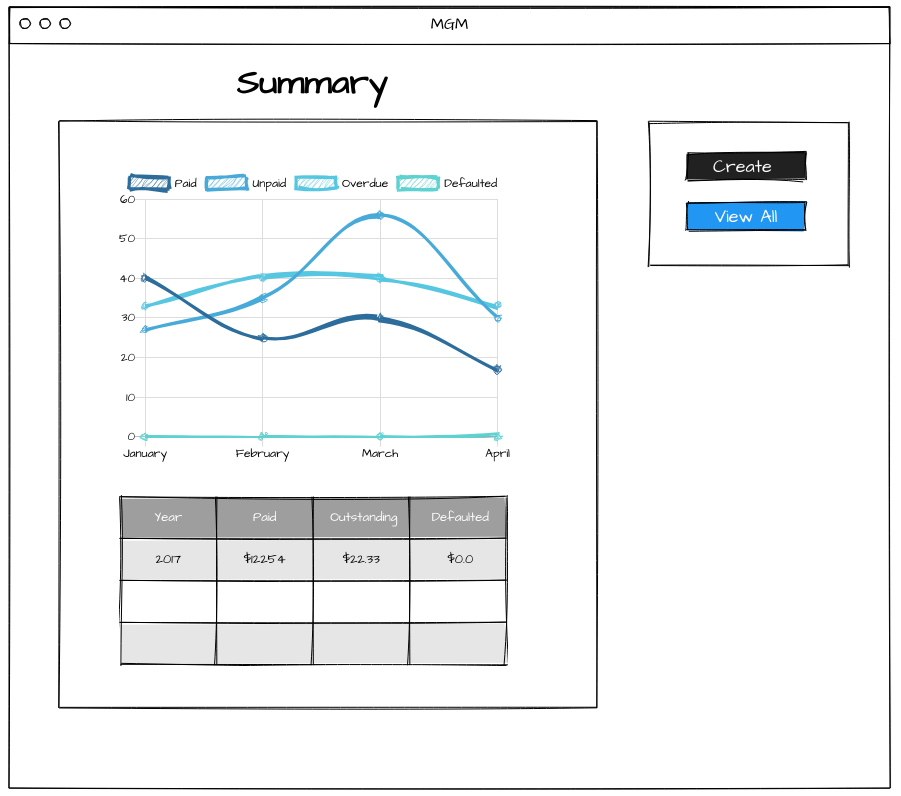

<!-- Heading start-->
<h2 align="center"> feature/dashboard</h2>

Angular landing page and dashboard

    <picture>
        
    </picture>

### Backlog
- [x] Scaffold new app to include landing page and dashboard
- [ ] Remove redundant css/js for landing page
- [ ] Add new login page with reCAPTCHA
- [ ] Unit tests for submitting a contact form and logging in
- [ ] Release branches
- [ ] Deploy front-end and update SSL certificate
- [ ] Deploy back-end and update SSL certificate

## A few wireframes
An invoice feature could be added to the dashboard...

### `create invoice`

  

### `view invoices`

  

### `summary`

  
